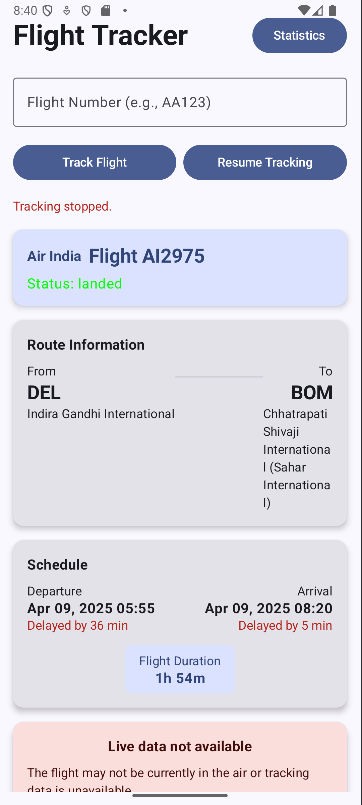
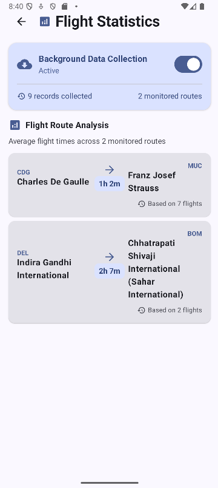

# Flight Tracker Application

## Overview
A modern Android application for tracking real-time flight data, providing users with up-to-date information about flights, including departure and arrival times, delays, and route information. The app offers both online functionality using the Aviation Stack API and offline capabilities through local data storage.

## Features
- Real-time flight tracking using live data
- Search flights by airline, flight number, or route
- Save favorite flights for quick access
- View flight details including:
  - Departure and arrival times
  - Origin and destination airports
  - Flight status (on-time, delayed, cancelled)
  - Delay information
- Offline access to previously viewed flight data
- Background updates for tracked flights
- Statistics on flight punctuality and routes

## Screenshots

## Technology Stack
- **Language**: Kotlin
- **UI Framework**: Jetpack Compose
- **Architecture**: MVVM (Model-View-ViewModel)
- **Libraries**:
  - Retrofit & OkHttp: Network requests
  - Moshi: JSON parsing
  - Room: Local database
  - Coroutines & Flow: Asynchronous operations
  - WorkManager: Background tasks scheduling
  - Lifecycle components: ViewModel integration
  - Material3: Modern UI components

## Setup Instructions
1. Clone the repository
2. Open the project in Android Studio (Arctic Fox or newer)
3. Create an account at [Aviation Stack](https://aviationstack.com/) to get an API key
4. Add your API key to the project:
   - Create a file named `apikey.properties` in the project root
   - Add the line: `AVIATION_STACK_API_KEY="your_api_key_here"`
5. Sync the project and build

## Usage Guide
- **Search Flights**: Use the search bar to find flights by number, airline, or route
- **Track Flights**: Mark flights as favorites to keep track of them
- **View Details**: Tap on a flight to see comprehensive information
- **Offline Access**: Previously loaded flight data is available offline
- **Settings**: Configure update frequency and data retention policies

## Architecture
The application follows the MVVM (Model-View-ViewModel) architecture pattern with these key components:

- **Data Layer**:
  - `FlightRepository`: Central data source that coordinates API and database access
  - `FlightApiService`: Handles network requests to the Aviation Stack API
  - `FlightDatabase` & `FlightRecordDao`: Local data persistence

- **ViewModel Layer**:
  - `FlightTrackingViewModel`: Manages flight search and tracking
  - `FlightStatisticsViewModel`: Handles statistics and data collection settings

- **UI Layer**:
  - Jetpack Compose screens for a modern, declarative UI
  - State hoisting pattern for UI state management
  - Material3 components for consistent design language

## Database Structure
The app uses Room database with the following main entity:

- `FlightRecord`: Stores historical flight data including:
  - Flight identification (number, airline)
  - Route information (departure/arrival airports and cities)
  - Scheduled and actual times
  - Delay information
  - Record metadata (when collected, flight date)

- `RouteInfo`: Stores information about unique routes:
  - Origin and destination airports
  - Statistics about frequency and punctuality

## API Integration
The app integrates with the [Aviation Stack API](https://aviationstack.com/) to fetch real-time flight data. The implementation includes:

- RESTful API calls using Retrofit
- JSON parsing with Moshi adapters
- Error handling and offline support
- Rate limiting consideration
- Background data refreshing with WorkManager

## Data Flow
1. User initiates a flight search
2. App first checks local database for matching data
3. If data is missing or outdated, a network request is made
4. Results are displayed and simultaneously cached for offline access
5. Background workers periodically update tracked flight information